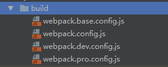
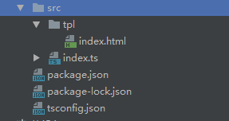
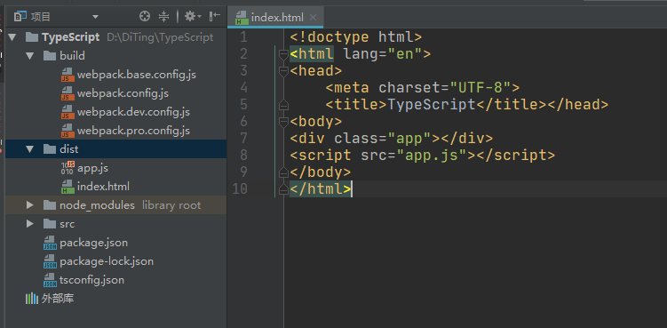

# TypeScript构建工具

## 安装webpack

- 本地安装`webpack`，`webpack-cli`，`webpack-dev-server`
```js
# npm install webpack webpack-cli webpack-dev-server -save
```

## 准备webpack配置文件

- 配置文件分为：公共环境，开发环境，生产环境。
- 其中，开发环境和生产环境需要做的事情不一样，为了工程的可维护性，单独配置，最后通过插件合并。

### 创建build目录
- build目录内分别创建`webpack.base.config.js`(公共环境)，`webpack.dev.config.js`(开发环境)，`webpack.pro.config.js`(生产环境)，`webpack.config.js`4个配置文件。
- `webpack.config.js`是所有所有配置文件的入口。公共环境，开发环境和生产环境的配置在这里合并。



### 创建tpl目录

- 在`src`目录下创建`tpl`目录用于存放模板，再创建`index.html`文件。



```html
<!--./src/tpl/index.html-->
<!DOCTYPE html>
<html lang="en">
<head>
    <meta charset="UTF-8">
    <title>TypeScript</title>
</head>
<body>
    <div class="app"></div>
</body>
</html>
```

### 配置webpack.base.config.js公共环境

- 本地安装`html-webpack-plugin`，`ts-loader`，`typescript`
- `html-webpack-plugin`，通过模板生成网站首页，把输出文件自动嵌入到文件中。
- `ts-loader`，webpack编译ts。

```js
# npm install html-webpack-plugin ts-loader typescript -save
```

- 配置文件内容

```js
//./build/webpack.base.config.js
const HtmlWebpackPlugin = require('html-webpack-plugin');

module.exports = {
    //指定入口文件
    entry: './src/index.ts',
    //输出
    output: {
        //输出文件名
        filename: 'app.js'
    },
    resolve: {
        //扩展名
        extensions: ['.js', '.ts', '.tsx']
    },
    module: {
        rules: [
            {
                test: /\.tsx?$/i,
                use: [{
                    //打包编译ts
                    loader: 'ts-loader'
                }],
                exclude: /node_modules/
            }
        ]
    },
    plugins: [
        new HtmlWebpackPlugin({
            template: './src/tpl/index.html'
        })
    ]
}
```

### 配置webpack.dev.config.js开发环境

- 当JS异常抛出时，想知道错误发生在文件的哪一行，`Source Maps`可以解决这个问题。
- `cheap`会忽略文件的列信息，只需要行信息。
- `module`会定位到ts的源码，而不是通过`ts-loader`转移后的js源码。

```js
//./build/webpack.dev.config.js
module.exports = {
    devtool: 'cheap-module-eval-source-map'
}
```

### 配置webpack.pro.config.js生产环境

- 安装`clean-webpack-plugin`,每次成功构建之后，清空目录`dist`目录
- 为了避免缓存，构建的时候会在文件后加上hash，多次构建就会产生很多无用的。

```js
# npm install clean-webpack-plugin -save
```
- 配置文件内容

```js
//./build/webpack.pro.config.js
const {CleanWebpackPlugin} = require('clean-webpack-plugin');

module.exports = {
    plugins: [
        new CleanWebpackPlugin()
    ]
}
```

### 配置webpack.config.js入口文件

- 安装`webpack-merge`，将其他三个配置文件进行合并。

```js
# npm install webpack-merge -save
```

- 配置文件内容

```js
//./build/webpack.config.js
const merge = require('webpack-merge');
const baseConfig = require('./webpack.base.config');
const devConfig = require('./webpack.dev.config');
const proConfig = require('./webpack.pro.config');
//判断当前环境是开发环境还是生产环境
const config = process.NODE_ENV === 'development' ? devConfig : proConfig

module.exports = merge(baseConfig, config)
```

## 修改npm脚本

- 修改`package.json`，开发环境启动和生产环境启动

```js
//./package.json
//更改入口
"main": "./src/index.ts",
"scripts": {
  //启动开发环境
  "start": "webpack-dev-server --mode=development --config ./build/webpack.config.js",
  //启动生产环境
  "build": "webpack --mode=production --config ./build/webpack.config.js",
},
```

- `npm run start`，运行开发环境，打开`http://127.0.0.1:8080/`查看。
- `npm run build`，运行生产环境，生成`dist`文件。生成的`index.html`文件使用之前`/src/tpl/index.html`为模板，新增生成的`app.js`文件引用。

