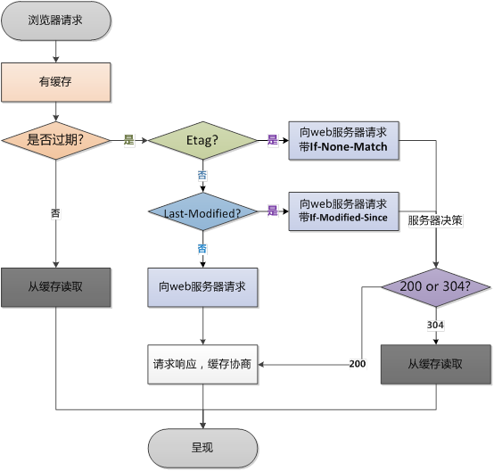

# 自我介绍
- 你好，我叫×××，在项目中担任前端组长的职务。
- 所作的项目是前后端分离，基于Vue和React相关进行开发，根据项目需要进行微信小程序开发。
- 工作职责负责开发前期项目工作分配和进度控制，每周的技术分享，开发过程中代码的高效。
- 空闲时间喜欢捣鼓一些项目，学习新的知识和技术。
- 有很强解决问题的能力。平时通过Github，知乎等平台学习新技术。

# 最近做个的比较有意思的项目
- 爬取网易云音乐评论，通过小程序展示的业余项目
- 为什么要做:
- 如何做:
- 在做的过程中遇到什么问题:
- 怎么解决的:
- 最后取得什么结果:

# Vue常见生命周期
- beforeCreate 创建前
- created 创建后
- beforeMount 载入前
- mounted 载入后
- beforeUpdate 更新前
- updated 更新后
- beforeDestroy 销毁前 
- destroyed 销毁后

# 如果在mounted注册了一个滚动事件，需不需要销毁
- 注册的滚动事件可以再beforeDestroy中进行销毁。

# API请求是放在created中还是mounted中
- created，beforeMount和mounted三种生命周期中，data已经可以操作，但是如果有操作dom还是要在mounted中。
- 在mounted中，因为created中视图dom还没有渲染出来，如果直接去操作dom节点，无法找到元素。
- 在mounted中，由于此时的dom元素已经渲染出来了，可以直接使用dom节点。

# SSR(服务端渲染)如何发送请求
- 使用asyncData方法，asyncData方法会在组件(限于页面组件)每次加载之前被调用。
- 可以在服务端或路由更新之前被调用。
- Nuxt.js会将asyncData返回的数据融合组件data方法返回的数据一并返回给当前组件。
- 由于asyncData方法是在组件初始化前被调用，在方法内是没有办法通过this来引用组件的实例对象的。
```js
import axios from "axios";
export default {
    data() {
      return {
        dataList: []
      }
    },
    async asyncData({ params  }) {
      let info = await axios.get('http://system.ihuzb.cn/api/selectMaxLoveCommentList');
      return {title: info.data.data}
    }
  }
```

# Nuxt中的asyncData与Vue中的data有什么区别
- asyncData是在Vue页面创建期间调用，用于给页面变量进行赋值的数据。
- 和data之间的区别就是，在SSR渲染过程中这部分数据会被加载到页面上，SEO可以检索到这部分数据。
- 而在mounted中获取的数据需要先保存到data中再进行渲染，所以数据放在mounted中加载，SEO是检索不到这部分数据的。

# Axios背后是封装的浏览器的什么对象或者是功能
- axios是一个基于Promise用于浏览器和nodejs的HTTP客户端，本质上也是对原始XHR的封装，只不过是Promise的实现版本。
- 从浏览器中创建XMLHttpRequest，这是Ajax实现的核心。

# 在浏览器中那两个对象可以发起请求
## XMLHttpRequest
```js
//GET 请求
let req = new XMLHttpRequest();
req.onreadystatechange = () => {
  console.log(JSON.parse(req.responseText) );
};
req.open('GET','http://system.ihuzb.cn/api/selectMaxLoveCommentList');
req.send();
```

## Fetch
```js
//GET 请求
fetch('http://system.ihuzb.cn/api/selectMaxLoveCommentList')
  .then(function(response) {
    return response.json();
  })
  .then(function(myJson) {
    console.log(myJson);
  });
```

# 强缓存和协商缓存
[大公司里怎样开发和部署前端代码？](https://www.zhihu.com/question/20790576)

## 浏览器缓存
- 第一次请求资源获得资源后，根据返回的信息来告诉如何缓存资源，可能采用强缓存，也可能是协商缓存。这都需要根据想应的header内容来决定的。
- 第一次请求时：(如图所示)浏览器请求资源，本地没有缓存，向web服务器请求，得到资源，缓存协商，呈现资源。

- 后续在进行请求时：

- 会先获取该资源缓存的header信息，判断是否命中强缓存(cache-control和expires信息)。
- 若命中直接从缓存中获取资源信息，包括缓存header信息；
    - cache-control 资源第一次的请求时间和cache-control设定的有效期，计算出一个资源过期时间，再拿这个过期时间跟当前的请求时间比较，如果请求时间在过期时间之前，就能命中缓存。
        - 还有几个比较常用的设置值：
            - no-cache 不使用本地缓存。
            - no-store 直接进值浏览器缓存数据，每次用户请求该资源，都会向服务器发送一个请求，每次都会下载完整的资源。
            - public 可以被所有的用户还款，包括终端用户和CDN等中间代理服务器
            - private 只能被终端用户的浏览器缓存，不允许CDN等中继缓存服务器对其缓存。
    - expires 一个未来时间绝对时间的GMT格式的时间字符串，如果发送请求的时间在此之前，那么本地缓存始终有效，否则就会发送请求到服务器来获取资源。
    - 如果cache-control与expires同时存在的话，cache-control的优先级高于expires。
- 本次请求不会与服务器进行通信。
- 若没有命中强缓存，浏览器会发送请求到服务器，请求会携带第一次请求返回的有关缓存的header字段信息(Last-Modified/If-Modified-Since和Etag/If-None-Match)，由服务器根据请求中的相关header信息来比对结果是否协商缓存命中。
    - Last-Modified/If-Modified-Since 浏览器第一次跟服务器请求一个资源，服务器返回这个资源的同时，通过Last-Modified返回这个资源在服务器上的最后修改时间。
    - Etag/If-None-Match 由服务器生成的每个资源的唯一表示字符串，只有资源有变化这个值就会改变。
    - 服务器会优先验证Etag，一致情况下才会继续比对Last-Modified，最后才决定是否返回304。
- 若命中，则服务器返回新的相应header信息更新缓存中的对应header信息，但是并不返回资源内容，告知浏览器可以直接从缓存获取返回304 Not Modified.
- 若没命中，返回最新的资源内容。Last-Modified的Header在重新加载的时候会被更新，下次请求时，If-Modified-Since会启用上次返回的Last-Modified值

## 强缓存(本地缓存)
- 资源缓存的header信息命中强缓存，直接从缓存中获取，不经过服务器。
- 返回状态码200

## 协商缓存
- 资源缓存的header信息未命中强缓存，请求服务器，这个时候会把之前请求资源得到的Last-Modified和Etag带上，但是会改个名字，Last-Modified改为If-Modified-Since，Etag改为If-None-Match。
- 服务端结构到后把带过来的标识进行对比，判断资源是否更改。
    - 如果资源有更改，返回新资源和更新对应的Last-Modified和Etag。
    - 如果资源没有更改，服务器返回304，当浏览器收到304响应之后，就会从缓存中加载资源。
- 返回状态码 304 Not Modified

## 用户行为对缓存的影响


# VueCli构建后的资源为什么带hash
- VueCli编译生成的静态资源默认在它们的文件名中包含了hash以便更好的控制缓存。

# 什么是异步编程
- JS语言的执行环境是“单线程”，就是指一次只能完成一件任务。如果有多个任务，就必须排队，前面一个任务完成，再执行后面一个任务，以此类推。
- 异步就是一个任务分为两段，先执行第一段，然后转而执行其他任务，等做好了准备，再回过头执行第二段。
- 排在异步任务后面的代码，不会等待异步任务结束会马上运行，也就是或，异步任务不具有“堵塞”效应。
# Promise是什么，如何使用
- Promise是一个代理对象，被代理的值再Primise对象创建时可能是未知的。允许你为异步操作的成功和失败分别绑定相应的处理方法。
- 这让异步方法可以像同步方法那样返回值，但并不是立即返回最终结果，而是一个能代表未来出现的结果的promise对象。
- [Promise介绍](https://ihuzb.github.io/2019/06/30/ZRn6kBsoy4/)