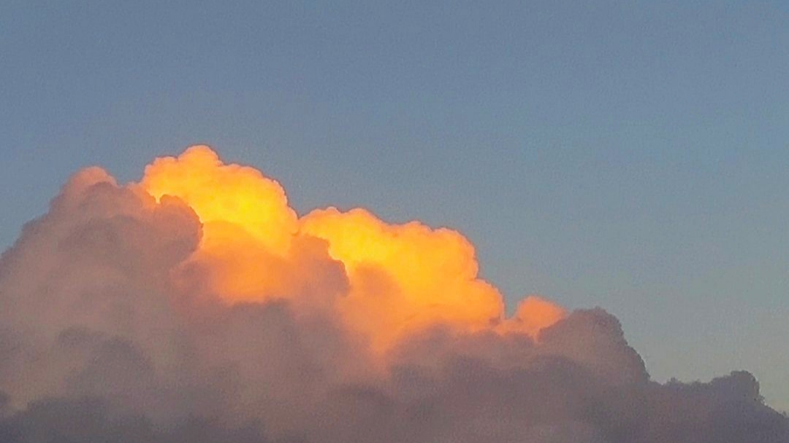

临近下班，许久未动笔突然想写点什么。

一个人呆的久了，学会把无关紧要的情绪隐藏，好像除了挣钱和远行，没有什么能提起我的兴趣。

好像是应了那句话：成年人，要把情绪戒掉。

看着大家各种追剧、追综艺、追星，乐此不疲，其乐融融，废寝忘食。沉浸在喜欢的事情中不能自拔。

我除了看经久不衰的《海绵宝宝》、《蜡笔小新》等也没有过多的爱好，感觉自己挺可悲的，说不定到老回想起来，碌碌无为过完这一生。

我也用微博，但我在微博上不发表任何评论，因为我的意见并不会有什么实质性作用。有时看着网友各显神通，从各种角度剖析，分解。言辞之凿凿，语言之精辟，角度之刁钻，让我发自内心的佩服。

挺好，这是我常用的一种评价。

没有很好那么好，也没有不好那么坏。

就，挺好。